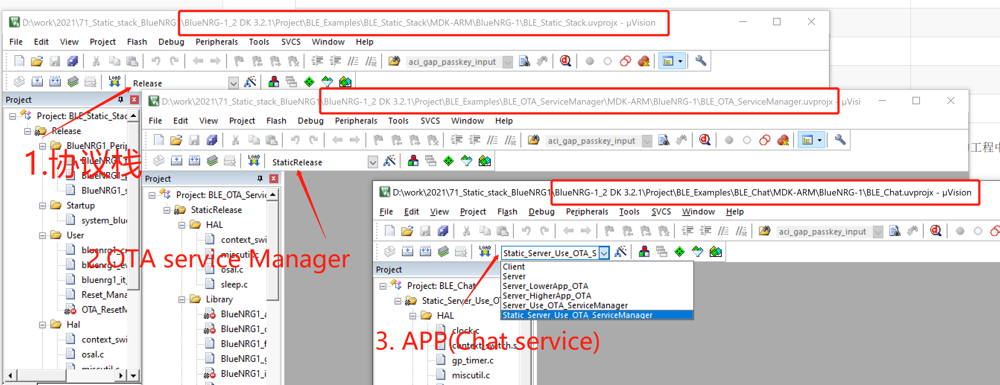

# 静态协议栈使用说明

​    下面举例子基于BlueNRG-1/2平台使用静态协议栈适配 OTA_ServiceManager 和应用的例子。这里的主要结构分配如下表.

| Flash                   |      |
| :---------------------- | :--- |
| NVM                     |      |
| APP                     |      |
| BLE_OTA_ServiceManager  |      |
| BLE Stack(basic or full statck ) |      |
|                         |      |

主要涉及到3个工程。这里我只适配了BlueNRG-1/2 Keil平台，并没有适配IAR和Truestudio. 为了方便对比和调试，我只在原先的工程中增加编译工程target，原先有的编译target选项并不受影响。测试编译下载使用静态协议栈时，请分别按顺序下载如下工程。

BlueNRG-1 默认配置了BLE_STACK_FULL_CONFIGURATION和BLE_STACK_BASIC_CONFIGURATION, 可以通过配置选项切换。需要注意的是，BLE Stack ， BLE_OTA_ServiceManager 和APP需要同时为FULL stack或者同时为basic stack。

BlueNRG-2 默认使用的是BLE_STACK_CONFIGURATION=BLE_STACK_FULL_CONFIGURATION

其他详细分析文档可以参考**《BlueNRG系列如何使用静态协议栈.pdf》《BlueNRG系列存储分析（Flash and RAM）.pdf》《安装GNU 工具链.pdf》**

OTA 升级的操作可以参考文档**《FAQ_ BlueNRG-x系列官方OTA操作简介.pdf》**

### BlueNRG-1/2使用Full 协议栈 OTA_ServiceManager + 静态协议栈 Flash分布如下图

| Flash                  | size                                                 |
| :--------------------- | :--------------------------------------------------- |
| NVM                    | 4KB                                                  |
| APP                    | 134KB(0x21800)  or        //                         |
| BLE_OTA_ServiceManager | 10KB(0x2800)              // 0x0001B000 ~ 0x0001D800 |
| BLE Stack(Full stack)  | 108KB(0x1B000)         // 0x00000000 ~ 0x0001B000    |
|                        |                                                      |

注释： 这里地址采用相对地址

### BlueNRG-1使用Basic 协议栈 OTA_ServiceManager + 静态协议栈 Flash分布如下图

| Flash                   | size                                          |
| :---------------------- | :-------------------------------------------- |
| NVM                     | 4KB                                           |
| APP                     | 64KB(0x10000)      //                         |
| BLE_OTA_ServiceManager  | 10KB(0x2800)       // 0x00014800 ~ 0x00017000 |
| BLE Stack(basic statck) | 82KB(0x14800)      // 0x00000000 ~ 0x00014800 |
|                         |                                               |

### 

