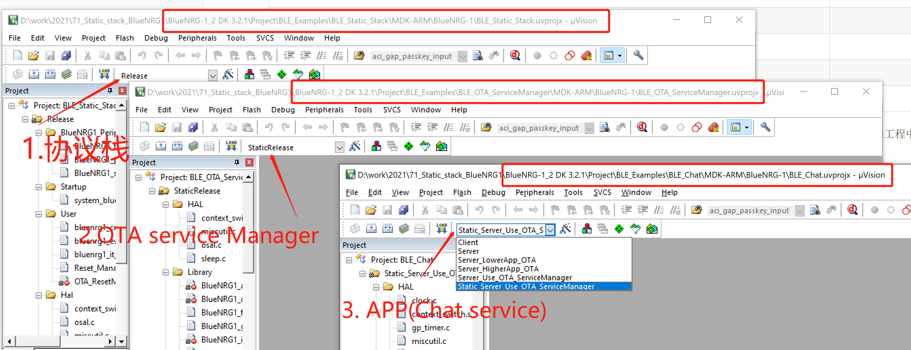

# 静态协议栈使用说明

​    下面举例子基于BlueNRG-1/2平台使用静态协议栈适配 OTA_ServiceManager 和应用的例子。这里的主要结构分配如下表.

| Flash                   |      |
| :---------------------- | :--- |
| NVM                     |      |
| APP                     |      |
| BLE_OTA_ServiceManager  |      |
| BLE Stack(basic statck) |      |
|                         |      |

主要涉及到3个工程。这里我只适配了BlueNRG-1/2 Keil平台，并没有适配IAR和Truestudio. 为了方便对比和调试，我只在原先的工程中增加编译工程target，原先有的编译target选项并不受影响。测试编译下载使用静态协议栈时，请分别按顺序下载如下工程。

BlueNRG-1 默认使用的是BLE_STACK_CONFIGURATION=BLE_STACK_BASIC_CONFIGURATION

BlueNRG-2 默认使用的是BLE_STACK_CONFIGURATION=BLE_STACK_FULL_CONFIGURATION

其他详细分析文档可以参考**《BlueNRG系列如何使用静态协议栈.pdf》《BlueNRG系列存储分析（Flash and RAM）.pdf》《安装GNU 工具链.pdf》**

OTA 升级的操作可以参考文档**《FAQ_ BlueNRG-x系列官方OTA操作简介.pdf》**

### BlueNRG-2使用 OTA_ServiceManager + 静态协议栈 Flash分布如下图

| Flash                  | size  |
| :--------------------- | :---- |
| NVM                    | 4KB   |
| APP                    | 134KB |
| BLE_OTA_ServiceManager | 10KB  |
| BLE Stack(Full stack)  | 108KB |
|                        |       |

### BlueNRG-1使用 OTA_ServiceManager + 静态协议栈 Flash分布如下图

| Flash                   | size                               |
| :---------------------- | :--------------------------------- |
| NVM                     | 4KB                                |
| APP                     | 64KB    //                         |
| BLE_OTA_ServiceManager  | 10KB      // 0x0014800 ~  0x017000 |
| BLE Stack(basic statck) | 82KB      // 0x0000000 ~ 0x0014800 |
|                         |                                    |

### 

